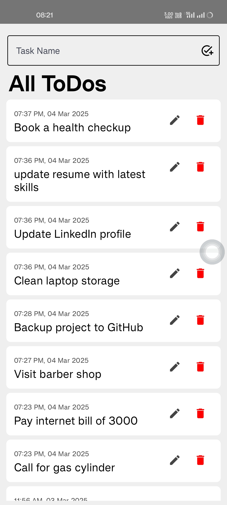
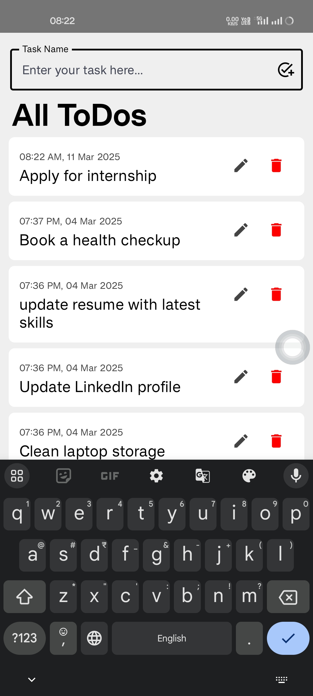

# 📋 To-Do App

It is a user-friendly **To-Do Application** built with Kotlin and Jetpack Compose, designed to help users manage their daily tasks effortlessly.

---

## 📱 Planned Features

- [x] Add new tasks
- [x] delete tasks
- [ ] Edit and mark tasks as completed
- [ ] Filter tasks (All, Completed, Pending)
- [x] Local Storage with Room Database
- [x] Modern UI with Jetpack Compose
- [ ] Dark Mode Support

---

## 🛠️ Tech Stack (Planned)

| Technology | Purpose |
|---|---|
| Kotlin | Core Language |
| Jetpack Compose | UI Toolkit |
| Room Database | Persistent Storage |
| MVVM | Architecture Pattern |
| Material 3 | UI Components |

---
## 📸 Screenshots 

---

## 📝 License  

Copyright © 2025 **Abbas Ansari** 

All rights reserved.

---

👨‍💻 Developed by **Abbas Ansari**  
🚀 Happy Coding!  

---
